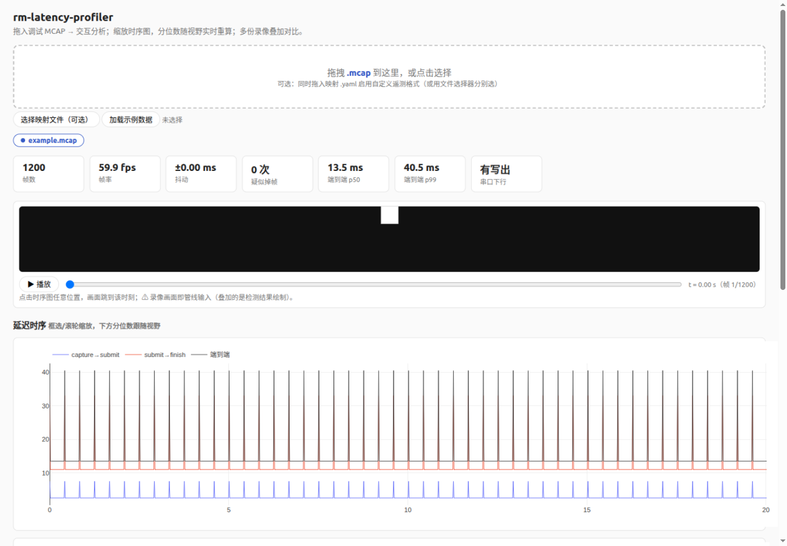

# rm-latency-profiler

RoboMaster 视觉链路**黑盒延迟分析工具**：不吃队内代码一行，直接消费调试录像，
回答三个问题——**延迟有多大、瓶颈在哪一段、异常发生在什么时候**。

## 它做什么

- **MCAP 离线分析**：读 Foxglove 调试录像里的逐帧遥测，输出三段延迟
  （capture→submit 传输段 / submit→finish 计算段 / 端到端）的
  p50/p95/p99 分位数、全程时序图、分布直方图、帧率与掉帧检测（含
  **掉帧归因**：计算过载 vs 采集侧断流）、串口下行增量时间线，汇总为
  单文件 HTML 报告（离线可打开）。
- **A/B 对比报告**：`compare` 命令对两份录像出 delta 表（改善绿/恶化红）
  与对齐叠加曲线，优化改动一键验收；**p50 带统计噪声检验**——delta 落在
  95% 噪声带内会被明确标记"噪声内，不构成结论"，防止把抖动当成成果。
- **交互式 Web 界面**：`rm-latency serve` 拖入录像即分析——缩放时序图，
  分位数随视野实时重算；多份录像叠加对比（优化前后的 A/B 验收）；
  **画面回放与延迟时序共用同一时间轴**，点哪里看哪里，延迟尖峰瞬间的
  相机输入一目了然。

测量边界（有意为之，见 docs/decisions.md）：工具覆盖软件可观测的全部段
（相机回调 → 指令写出），串口之后的下位机执行段无协议应答，不在测量范围内。



*点时序图任意位置，画面跳到该时刻；缩放时序图，下方分位数随视野实时重算。*

## 快速开始

**直接安装（推荐）**——pipx / uv 会自动建隔离环境并把命令放进 PATH，不涉及虚拟环境操作：

```bash
pipx install git+https://github.com/hxfhxy/rm-latency-profiler.git
# 或者：uv tool install git+https://github.com/hxfhxy/rm-latency-profiler.git
```

**从源码运行**（改代码或不想装 pipx）：

```bash
git clone https://github.com/hxfhxy/rm-latency-profiler.git
cd rm-latency-profiler
python -m venv .venv && source .venv/bin/activate
pip install -e .
```

装好后任选一种用法：

```bash
# 交互式 Web 界面（推荐）：拖入录像，缩放即重算，多录像叠加对比
rm-latency serve          # 浏览器自动打开 http://127.0.0.1:8321
rm-latency serve --example docs/example.mcap   # 带一键示例加载的演示模式

# 看一眼录像概况（--json 可机器读取）
rm-latency inspect run.mcap

# 生成静态 HTML 报告（支持一次多份录像），适合存档分享
rm-latency report run.mcap -o report/
# -> report/run-latency-report.html

# 导出逐帧数据 CSV，便于自行分析
rm-latency export run.mcap -o frames.csv

# A/B 对比（优化验收：同一段输入录像跑两遍，中间只改被测项）
rm-latency compare before.mcap after.mcap -o report/
```

一份合成录像生成的[示例报告](docs/example-report.html)可以直接用浏览器打开看效果。

## 接入别的队伍的遥测格式

通道按 schema 指纹自动发现，字段路径可经映射文件适配——不改工具代码：

```yaml
# my-team.yaml
fingerprint: "snap"          # 本队 jsonschema 文本中必然出现的字符串
fields:                      # 规范名: 消息内点分路径（未列出的回落默认值）
  stamp_ns: snap.t_cam
  capture_ns: snap.t_cam
  submit_ns: snap.t_in
  finish_ns: snap.t_out
```

```bash
rm-latency report run.mcap -m my-team.yaml
```

规范字段名全集见 `src/rm_latency/mapping.py` 的 `DEFAULT_FIELD_PATHS`；
分析至少需要 `stamp_ns / capture_ns / submit_ns / finish_ns` 四个字段。

## 遥测格式约定（默认 ACE 格式）

工具按 schema 内容自动发现遥测通道：任何 jsonschema 编码的通道，只要包含
`capture_to_submit_ms` 字段即被识别。逐帧消息需要：

| 字段 | 说明 |
|------|------|
| `header.stamp_ns` / `recv_ns` | 单调时钟域时间戳（字符串形式的 int） |
| `timing.capture_ns / submit_ns / finish_ns` | 三段计时锚点 |
| `timing.capture_to_submit_ms` | 通道识别指纹 |
| `serial_tx.*` | 累计下行计数（可选，全 0 时报告会注明） |

设计决策与理由见 [docs/decisions.md](docs/decisions.md)。

## 开发

```bash
python -m venv .venv && source .venv/bin/activate
pip install -e ".[dev]"
pytest          # 单元与契约测试，全部基于合成录像
ruff check .

# 前端 e2e 冒烟（可选）：pip install -e ".[e2e]" && playwright install chromium
```

CI 在 push/PR 时跑 ruff + pytest（Python 3.10/3.12 矩阵，含浏览器 e2e 冒烟）。

## Roadmap

- [x] MCAP 摄取 + 逐帧遥测表
- [x] 三段延迟分位数 + HTML 报告
- [x] 帧率/抖动/跳帧形态分解（D13）+ 掉帧归因 + 串口下行时间线
- [x] 跨队字段映射（YAML）
- [x] 交互式 Web 界面（视野缩放重算、多录像对比、画面回放）
- [x] A/B 对比报告（delta 表 + 叠加曲线）
- [ ] 发 PyPI / GitHub Release

## License

MIT
